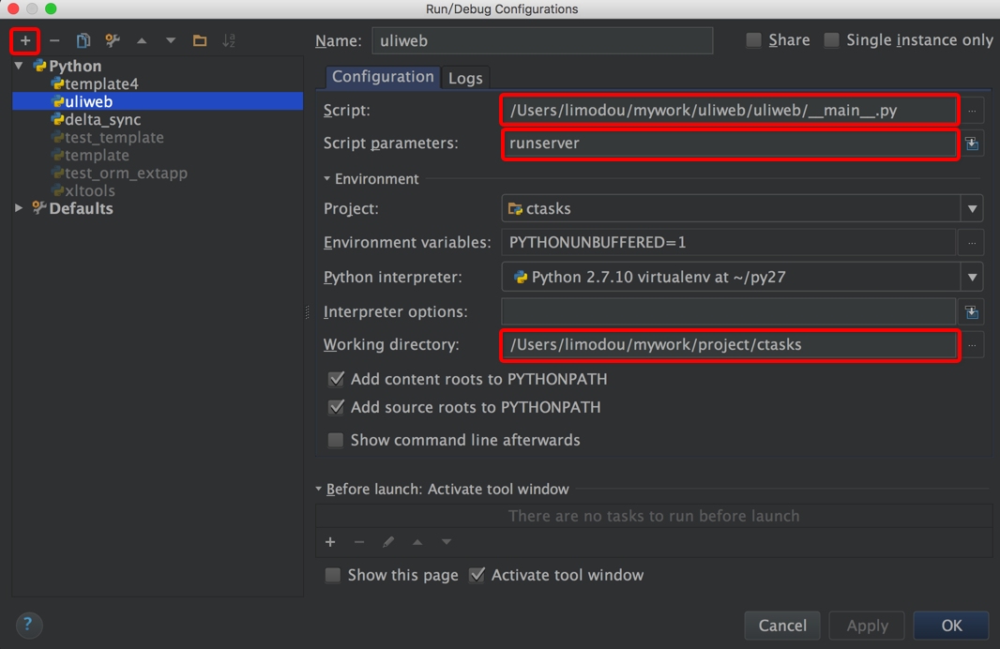
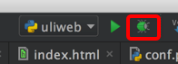

# 使用PyCharm进行调试

Uliweb可以使用象PyCharm进行程序调试,下面讲一下大概的设置方式。

## 创建调试配置

在PyCharm右上角可以切换运行的配置, 点击后可以看到:

选择第一项 `Edit Configuration...`, 然后进入:

先点击左上角添加一个配置项。

然后在 `Script` 处填上 Uliweb 安装目录下的 `__main__.py` 文件, 这个可以作为启动文件。

接着在 `Script Parameters` 处输入将要使用的命令行, 如 `runserver` 。这里还可以指定象 `-p` 之类
的端口号参数。

然后在 `Working Directory` 处填入你的项目目录。

这样环境就创建好了。

## 调试

在需要时,点击环境选项右侧的 Bug 按钮,就可以进入调试环境了。

调试窗口一般在下面, 最左侧是用来控制继续运行,停止等的按钮。上面是 Step Over, Step Into, Step Out之类的按钮。

它有两个Tab窗口, Debugger用来查看运行变量, 调用栈。 Console是输出控制台。

