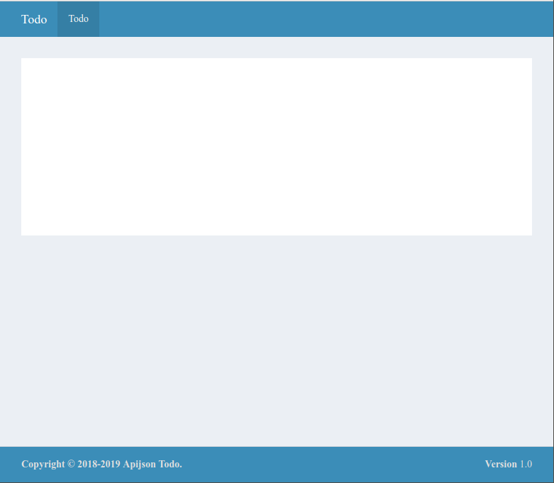
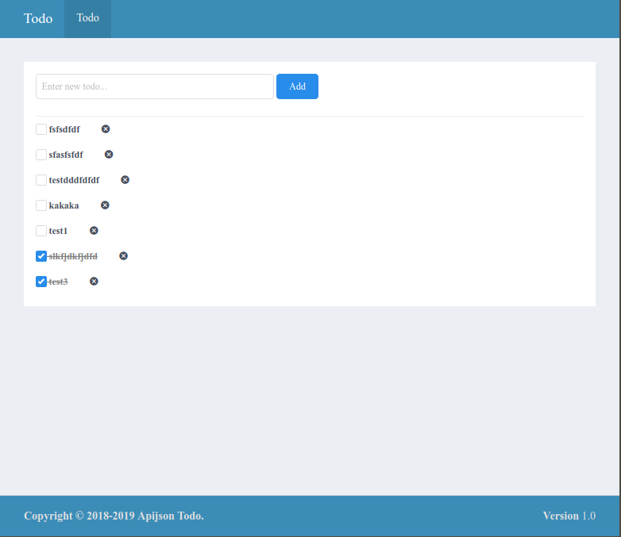

# Simple Todo (Uliweb 版本) 之 高级篇

本版本是从 [http://simple-is-better.com/news/detail-309](http://simple-is-better.com/news/detail-309) 来的，并且已经使用Uliweb
实现了一个 [基础版本](todo_basic.html) ，不过这个基础版本讲述的是最基本的Uliweb的用法，因此叫基础篇。
在这个高级篇中，我希望向大家介绍更加高级一些的内容。其中有些功能要依赖于 uliweb-ui 系列模块。

## uliweb-ui 系列模块介绍

因为uliweb原有的app集合项目plugs有支持的css框架过老,比较臃肿,所以uliweb3选择不兼容plugs,所以这里介绍后来发展的uliweb-ui系列模块的配合开发

1. [uliweb-ui](https://github.com/uliwebext/uliweb-ui) : 为uliweb加上常用的前端模块支持如jquery插件,select2,vuejs等等
2. [uliweb-layout](https://github.com/uliwebext/uliweb-layout) : 为uliweb加上常用的页面布局的支持,基于 [AdminLTE](https://adminlte.io/)
3. [uliweb-menu](https://github.com/uliwebext/uliweb-menu) : 为uliweb加上菜单功能
4. [uliweb-apps](https://github.com/limodou/uliweb-apps) : uliweb功能类app集合
5. [uliweb-comui](https://github.com/zhangchunlin/uliweb-comui) : 类似于uliweb-ui (zhangchunlin维护)
6. [uliweb-apijson](https://github.com/zhangchunlin/uliweb-apijson) : apijson的uliweb实现,加上通用的数据库后端api

这些模块可以参考requirements.txt手动安装,也可以直接使用 `pip install -r requirements.txt`安装

## 构建流程

### 构建初始环境

在基础篇中讲过的内容，这里不再赘述。假定目前初始为$project，操作如下:


```
uliweb makeproject apijson_todo
cd apijson_todo
uliweb makeapp todo
```


## settings.ini配置

修改apps/settings.ini为以下内容:


```
[GLOBAL]
DEBUG = False
DEBUG_CONSOLE = False
DEBUG_TEMPLATE = False

INSTALLED_APPS = [
    'uliweb.contrib.orm',
    'uliweb_apps.site',
    'uliweb_comui',
    'uliweb_apijson.apijson',
    'todo',
]
```


## 基本布局

前面我们看到，已经加入了几个app，其中 `uliweb_apijson.apijson` 提供了通用的Model的CRUD(Create Read Update Delete)的后端api接口,再经过简单settings配置以后就可以提供给前端页面里用javascript直接调用了。

而 `uliweb_apps.site`会引入依赖的 `uliweb_layout.layout` 以提供了基本的布局。在layout中的settings.ini中有几个参数可以设置

我们可以修改一部分，添加到apps/settings.ini中去:


```
[LAYOUT]
logo_lg = "Todo"
logo_mini = "T"
footer = '''    <div class="pull-right hidden-xs">
      <b>Version</b> 1.0
    </div>
    <strong>Copyright &copy; 2018-2019 Apijson Todo. </strong>
'''
```

另外`uliweb_layout.menu`加上了menu支持,可以用以下方式加上导航菜单

```
[MENUS]
MAINMENU <= {
    'subs':[
        {'name': 'todo', 'link':'/', 'title':u'Todo'},
    ]
}
```


这里有一个特别的地方，那就是MENUS <= 它的作用是替换原来的值。因为pyini在处理时，
如果遇到相同名字的两个变量，如果变量是不可变对象，则直接替换，如：str, int等。但
如果值是可变对象，如：list, dict，则会进行合并。因为上面的MENUS是list，所以缺省
情况下会进行合并，而我们的目的是想替换，所以使用 `<=` 就可以替换了。

然后我们在uliweb_apps/site/templates/site/layout1.html的基础上，来创建一个通用的基础模板，如命名为base.html,
内容如下:


```
{{extend "site/layout1.html"}}

{{block header_custom_menu}}{{end header_custom_menu}}
```

因为layout.html中还有用户的信息，但是我们这里并不使用，因此，我们将相关的header_custom_menu置为空。

然后在todo/templates下创建index.html，内容为:


```
{{extend "base.html"}}
```

好，目前差不多了，让我们回到命令行，在plugs_todo目录下运行:


```
uliweb runserver
```

如果没有错误，可以通过访问 [http://localhost:8000](http://localhost:8000) 看到如下界面:



## 创建Todo的Model

下面就是创建Todo表的结构。在todo下创建models.py文件，写入以下内容:


```
#coding=utf-8
from uliweb.orm import *

class Todo(Model):
    title = Field(str, verbose_name="标题", max_length=255, required=True)
    post_date = Field(datetime.datetime, verbose_name='提交时间', auto_now_add=True)
    finished = Field(bool, verbose_name='是否完成')
```

在todo下创建settings.ini，然后输入以下内容:


```
[MODELS]
todo = 'todo.models.Todo'
```

这样我们就将todo表做成配置化的了。关于配置化，详情可以查看 [Uliweb ORM](http://limodou.github.com/uliweb-doc/orm.html) 的文档。

在命令行下运行:


```
uliweb syncdb
```

来创建表。


## 处理Todo

之前在settings中加入了`uliweb_apijson.apijson`,为了让Todo这个model能被前端使用apijson的接口访问,还需在settings里增加一些配置,例子如下,主要是将Todo的CRUD接口让未登入访问(UNKNOWN)就能操作,对uliweb-apijson做进一步了解可以访问 [github上的项目](https://github.com/zhangchunlin/uliweb-apijson)

```
[APIJSON_MODELS]
todo = {
    "GET" : { "roles" : ["UNKNOWN"] },
    "HEAD" : { "roles" : ["UNKNOWN"] },
    "POST" : { "roles" : ["UNKNOWN"] },
    "PUT" : { "roles" : ["UNKNOWN"] },
    "DELETE" : { "roles" : ["UNKNOWN"] },
}

[APIJSON_REQUESTS]
todo = {
    "todo": {
        "POST" :{
            "DISALLOW" : ["id"],
            "NECESSARY" : ["title"],
        },
        "PUT" :{
            "NECESSARY" : ["id"],
        },
    }
}
```

现在uliweb-apijson的接口已经可以操作Todo这个表了,现在开始写前端的页面,在index.html里改写title和导航menu

```
{{block title}}Todo{{end title}}

{{block mainmenu}}
{{<< mainmenu('todo')}}
{{end mainmenu}}
```

接下来开始开始写主要的部分,改写content_main.下面增加的ui.vue和ui.iview是加入前端的框架支持.

```
{{block content_main}}
{{use "ui.vue"}}
{{use "ui.iview"}}
{{end content_main}}
```

然后是具体的前端展示相关代码

```
<style>
.disabled_todo {
    text-decoration: line-through;
    color: grey;
}
</style>
<div id="app">
    <i-input v-model="new_todo" @on-enter="add_todo" placeholder="Enter new todo..." style="width: 300px"></i-input>
    <i-button type="primary" @click="add_todo">Add</i-button>
    <br><br>
    <hr>
    <div v-for="todo in todos" :key="todo.id">
        <checkbox v-model="todo.finished" v-bind:class="{ disabled_todo: todo.finished }" @on-change="on_change(todo)">{todo.title}</checkbox> <i-button type="text" icon="close-circled" @click="remove_todo(todo)"></i-button>
    </div>
</div>

<script>
var vm = new Vue({
    el: '#app',
    delimiters: ['{', '}'],
    data:{
        new_todo : "",
        todos:[]
    },
    methods: {
        update_list: function(){
            var thisp = this
            var params = {
                "[]":{
                    "@query":2,
                    "todo":{
                        "@order":"finished+,id-"
                    }
                },
                "total@":"/[]/total"
            }
            $.ajax({
                type: "POST",
                url: "{{=url_for('uliweb_apijson.apijson.views.ApiJson.get')}}",
                contentType: 'application/json',
                data: JSON.stringify(params),
                success: function (data) {
                    if (data.code==200) {
                        thisp.todos = data["[]"]
                    }
                }
            })
        },
        add_todo: function(){
            var thisp = this
            var params = {
                "todo": {
                    "title": thisp.new_todo,
                },
                "@tag": "todo"
            }
            $.ajax({
                type: "POST",
                url: "{{=url_for('uliweb_apijson.apijson.views.ApiJson.post')}}",
                contentType: 'application/json',
                data: JSON.stringify(params),
                success: function (data) {
                    if (data.code==200) {
                        vm.new_todo = ""
                        vm.update_list()
                    }
                }
            })
        },
        remove_todo: function(todo){
            var thisp = this
            var params = {
                "todo": {
                    "id": todo.id,
                },
                "@tag": "todo"
            }
            $.ajax({
                type: "POST",
                url: "{{=url_for('uliweb_apijson.apijson.views.ApiJson.delete')}}",
                contentType: 'application/json',
                data: JSON.stringify(params),
                success: function (data) {
                    if (data.code==200) {
                        vm.update_list()
                    }
                }
            })
        },
        on_change: function(todo){
            var thisp = this
            var params = {
                "todo": {
                    "id": todo.id,
                    "finished": todo.finished
                },
                "@tag": "todo"
            }
            $.ajax({
                type: "POST",
                url: "{{=url_for('uliweb_apijson.apijson.views.ApiJson.put')}}",
                contentType: 'application/json',
                data: JSON.stringify(params),
                success: function (data) {
                    if (data.code==200) {
                        vm.update_list()
                    }
                }
            })
        }
    }
})
vm.update_list()
</script>
```

这里具体用到了[vuejs](https://cn.vuejs.org/)和[iview](https://iviewui.com/),进一步了解可以访问对应的网站.

最后这个例子在浏览器中的显示效果为:



